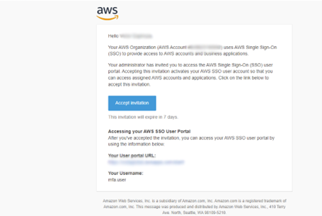
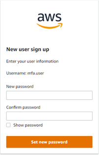
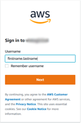
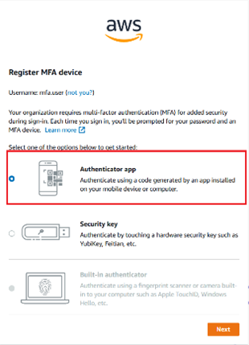
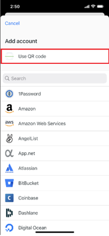
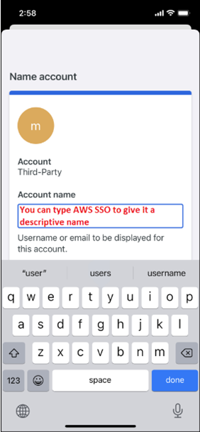
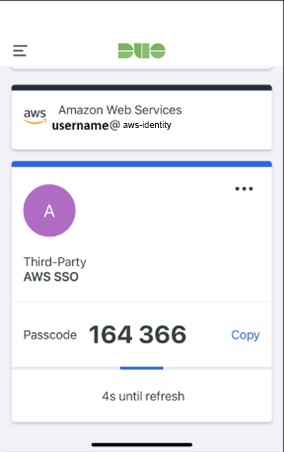

# AWS SSO LOG IN Process

You should receive an AWS invite email in your inbox once your SSO account is created that will look as follows:

Once you click on the accept invitation you will be directed to create a new password as shown below:

To log into AWS SSO please go to this website: [https://YOURSITE.awsapps.com/start](https://YOURSITE.awsapps.com/start)  
Replace YOURSITE with your correct url.

You will be directed to the logon page where you will be entering your username in the recommended format: firstname.lastname.

Example:

In the next page, you will be asked to register your MFA (Multi Factor Authenticator) device to access your AWS account.

You can use any MFA authenticator such as DUO Mobile, Microsoft Authenticator, Google Authenticator to add the AWS MFA account with QR Code as shown below:

This is how it looks in DUO after you type the name of the account:

Once you type the MFA code it may ask you to reset the password if this is your first logging into AWS SSO.
