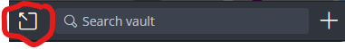

# Bitwarden CLI identity management workflow

## Overview

Bitwarden is an amazing open source password vault / OTP solution.

The vault portion is free and cloud synced, however the OTP portion requires a $10 / year subscription but is well worth 
it for the efficiency gained from not having to lookup and type / paste OTP/MFA tokens.

## Description

This workflow allows your securely store AWS account info and scripts so as not to have plain text files with aliases 
that would divulge sensitive info such as account numbers, usernames, and role names.

It also allows for assuming roles in any accounts you set up without having to lookup and type / paste MFA tokens.

## Installation
**Note: all tools and shell aliases are already installed in the dev container. You will still need to create secure notes **

### Host and dev container
Start by going to https://vault.bitwarden.com/#/register  and creating and account getting the personal premium account.

Go to https://bitwarden.com/download/ and install the Bitwarden plugin for your browser. 
All major browsers are supported on both desktop and mobile.  

### Host (only required if using this solution outside of dev container)
Download the CLI executable from same page you downloaded the browser plugin and place it in your path.  
I recommend putting in a bin folder in your home dir and adding that bin folder to your path.

**_Note: If you want to be able to use biometrics to unlock your Bitwarden vault on your host then also install the desktop client._**

Install the “jq” cli tool and ensure it's in your path. 
If your on Windows you can get the jq.exe and put it in the above recommended bin folder or some place else in your path.

Copy the SSM scripts from this repo in the /root/bin/aws folder and put in your bin folder or some place in your path.

Add the following to your .bashrc or .zshrc file your home directory.  
```bash
export AWS_PROFILE=YOUR-identity
alias load_aliases="eval \`bw get item aws_bash_rc | jq -r '.notes'\`";
alias bw_reload="bw sync; load_aliases";
alias unlock='export BW_SESSION="$(bw unlock --raw)"; bw sync; load_aliases; echo "export BW_SESSION=$BW_SESSION;load_aliases"'
echo "unlock"
```
Replace **YOUR-identity** with your aws identity for example: `export AWS_PROFILE=paul.robello-identity`


### Setup
You must login to your vault in your browser, desktop application if you installed it and in your dev containers.
To login via cli open a shell and type `bw login` to connect the cli to your Bitwarden account and initialize your cli vault.


## Setup of account and MFA

Setup Bitwarden to log into your AWS SSO account and assign it as your MFA device. 
It does not matter what you name the entry for this account in Bitwarden however I recommend [company]_aws_sso.  
Where [company] is an abbreviation for the company this entry is for. Prefixing [company] to scripts and aliases will
allow you to easily access different orgs / companies.


**_Note: When setting up Bitwarden OTP only populate the box with the secret, not the rest of provided URL parameters._**

Next setup Bitwarden to log into your AWS Identity in the identity account and assign it as your MFA provider. 
This entry should be named “[company]_aws_ident”.  
The reason this name is required, is because it must be a known name for the scripts below to auto obtain your MFA OTP 
token to assume roles.

## Bitwarden secure notes as scripts

**Tip: when working on scripts / large notes in bitwarden, you can pop out the bitwarden window, so it floats.


You can then stretch the window bigger which will let you then stretch the note edit box bigger.**

Using your browser log into your Bitwarden vault and create a secure note named **[company]_aws_bash_rc** with the following content:
```bash
alias [company]_aws_otp="bw get totp '[company]_aws_ident' | tr -d '\n'";
alias [company]_aws_assume="AWS_IDENTITY_ACCOUNT=[AWS_IDENTITY_ACCOUNT] source assume-role.sh [YOUR_AWS_SSO_ACCOUNT] [YOUR-identity]";
alias [company]_aws_assume_role="comp_aws_assume arn:aws:iam::[TARGET_ACCOUNT_NUM]:role/[ROLE_NAME] \`[company]_aws_otp\`";  

alias [company]_aws_jump="AWS_REGION=[TARGET_AWS_REGION] ssm-ssh.sh [EC2_INSTANCE_ID]";  
alias [company]_aws_scp="AWS_REGION=[TARGET_AWS_REGION] ssm-scp.sh [EC2_INSTANCE_ID] [TARGET_AWS_REGION_AZ]";  
alias [company]_aws_rds_pf="AWS_REGION=[TARGET_AWS_REGION] ssm-jump-tunnel.sh [EC2_INSTANCE_ID] [TARGET_AWS_REGION_AZ] 5432 [RDS_DNS_NAME] 5432";

echo "[company] aliases loaded";
```
Replace the following values in the template above with:
* [company] - abbreviated company name. example: myco
* [company2] - abbreviated 2nd company name. example: myco2 
* [AWS_IDENTITY_ACCOUNT] - the aws account number of the identity account for [company].
* [YOUR-identity] - Your AWS identity for example: AWS_PROFILE=paul.robello-myco-ident
* [YOUR_AWS_SSO_ACCOUNT] - Your AWS single sign on account for example: paul.robello
* [ROLE_NAME] - Name of the role you want to assume in the TARGET_ACCOUNT_NUM.
* [RDS_DNS_NAME] - DNS name of RDS or RDS proxy to connect to.
* [EC2_INSTANCE_ID] - EC2 instance id you want to ssh to or relay port forward through. 
* [TARGET_AWS_REGION] - Target AWS region where ec2 instance resides. example: us-east-1
* [TARGET_AWS_REGION_AZ] - Target AWS region qualified with az where ec2 instance resides. example: us-east-1a 
* [TARGET_ACCOUNT_NUM] - AWS account number for the target account.


**_Note: For the script eval to work all lines must end with a semicolon._**
The first 3 aliases are required to access any aws resources. The last 3 aliases are simply helpers for common tasks 
such as:
* accessing a jump host in a VPC
* copying files to / from a jump host in a VPC
* forwarding a local port to a RDS in a VPC.

The above script block is soft wrapping some lines, when you enter them ensure they are on a single line.

### Additional companies (optional)
Create a secure note named **[company2]_aws_bash_rc** with the following content:
```bash
alias [company2]_aws_otp="bw get totp '[company2]_aws_ident' | tr -d '\n'";
alias [company2]_aws_assume="AWS_IDENTITY_ACCOUNT=[AWS_IDENTITY_ACCOUNT] source assume-role.sh [YOUR_AWS_SSO_ACCOUNT] [YOUR-identity]";
alias [company2]_aws_assume_role="comp_aws_assume arn:aws:iam::[TARGET_ACCOUNT_NUM]:role/[ROLE_NAME] \`[company2]_aws_otp\`";  

alias [company2]_aws_jump="AWS_REGION=[TARGET_AWS_REGION] ssm-ssh.sh [EC2_INSTANCE_ID]";  
alias [company2]_aws_scp="AWS_REGION=[TARGET_AWS_REGION] ssm-scp.sh [EC2_INSTANCE_ID] [TARGET_AWS_REGION_AZ]";  
alias [company2]_aws_rds_pf="AWS_REGION=[TARGET_AWS_REGION] ssm-jump-tunnel.sh [EC2_INSTANCE_ID] [TARGET_AWS_REGION_AZ] 5432 [RDS_DNS_NAME] 5432";

echo "[company2] aliases loaded";
```

### Alias entrypoint
Now create a secure note named **aws_bash_rc** with the following content:
```bash
eval `bw get item [company]_aws_bash_rc | jq -r '.notes'`;
eval `bw get item [company2]_aws_bash_rc | jq -r '.notes'`; 
echo "all aws aliases loaded";
```
**_Omit company2 line if you are only using one company._**

This creates the entrypoint for your shell to load in all your aliases. You can easily create an alias note for each 
company / org then eval them all from the notes you create.

### Alias Descriptions:
#### Core
* unlock - unlocks your vault, syncs it with cloud, and calls load_aliases.
* * if you are using the dev container and PERSIST_BITWARDEN_SESSION=yes then it will also write your session key to /root/persisted/.bw_session and this file will be sourced by any other shells you open to reduce need to unlock vault.
* load_aliases - loads the secure note with name aws_bash_rc into your environment.
* bw_reload - syncs vault with cloud and calls load_aliases.

#### Custom
* [company]_aws_otp - Gets and displays your aws MFA token without a newline, so it can be embedded in aliases and scripts.
* [company]_aws_assume - used by [company]_role_assume to reduce boilerplate when you have lots of assume role aliases.
* [company]_aws_assume_role - grabs your MFA token and assumes a role in the target account
* [company]_aws_jump - opens an ssh session to the jump host in the target account.
* [company]_aws_scp - copies files to or from the jump host in the target account.
* [company]_aws_rds_pf - creates a port forward from your localhost through the jump host in the target account to the Postgres RDS instance.

You can use the above blueprint for as many accounts as you interact with, just give them unique aliases.

## Testing workflow

Open a new shell. You should see “unlock” printed in your terminal to remind you that you need to either unlock your 
vault or paste the vault session key.

**_Note: If you don't see “unlock” printed in your terminal then it's probably because you are not using bash as your 
shell and must include the .bashrc script into your shell startup sequence._**

Since this is the first shell you need to type `unlock` and enter you master password.  
If this succeeds you should see “all aws aliases loaded” after a few moments.

Now type [company]_aws_assume_role and hit enter. In a few moments you should see that your credentials will expire in 12 hours.

**_Note: Sometimes the [company]_aws_assume_role will fail with message about invalid MFA token, just retry a few times waiting 5 
or so seconds between each try. 
I think this is due to some kind of clock skew issue for the MFA token generation._**

**_Note: The role being assumed must be set to have a 12-hour expiration otherwise the assume role script will fail._**

After you have assumed the role you can now execute other SSM / AWS commands or use any of your other aliases or aws cli
commands.

### Auto start RDS port forwards with GDC_ENTRYPOINT
If you want to setup one or more SSM port forwards and are using the bitwarden solution for aws, you can do something like the following:  
Create an empty folder name whatever you want, in this example I will use "rdspf"  
In the rdspf folder create a file name **.env-gdc**  similar to the following:
```bash
# BEGIN this chunk helps speed up the launching of a GDC dedicated to port forwarding.
USE_PRECOMMIT="no"
SSH_KEYSCAN_HOSTS=""
PYTHON_VERSION=""
PHP_VERSION=""
USE_JAVA="no"
USE_DOT_NET="no"
GOLANG_VERSION=""
PULUMI_VERSION=""
GIT_NAME=""
# END this chunk helps speed up the launching of a GDC dedicated to port forwarding.

GDC_ENTRYPOINT="bash /workspace/start-pf.sh" # this gets run by the GDC automatically and has our ssm assume and ssh port forwarding
PORT_FWD0="5432:5432" # forwarding postgres port from container to host
#PORT_FWD1=5433:5433 # can map as many ports as you need, just make sure they are unique in the container and on host
```

Create another file named **start-pf.sh** that contains something similar to the following:
```bash
#!/usr/bin/env bash
FORCE_INTERACTIVE=yes # forces .bashrc to load
shopt -s expand_aliases # ensure our bitwarden aliases are available to the script
source /root/.bashrc # load all our aliases
vgh_js_prod_assume # this alias assumes an admin role in the js prod account
vgh_js_prod_rds_pf # this alias creates the ssm ssh port forward of postgres rds in aws to GDC
```

Then you can simply do **run-dev-container.sh rdspf** from the folder you created with the above 2 files.


It will start the GDC forwarding ports you requested from GDC to host, then it will assume the needed role in aws account, then ssm ssh port forward from aws to GDC.  
You can then open pg_admin dbeaver etc..., to localhost on port you specified for the host and manage DB in AWS.  
This works for jumphosts and other SSM Port forward related things.
