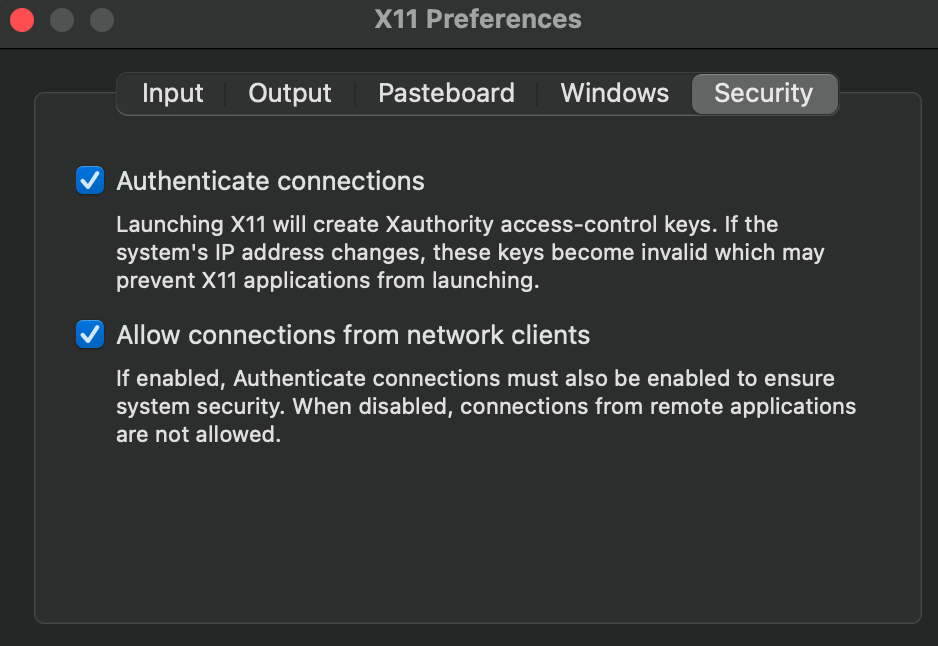
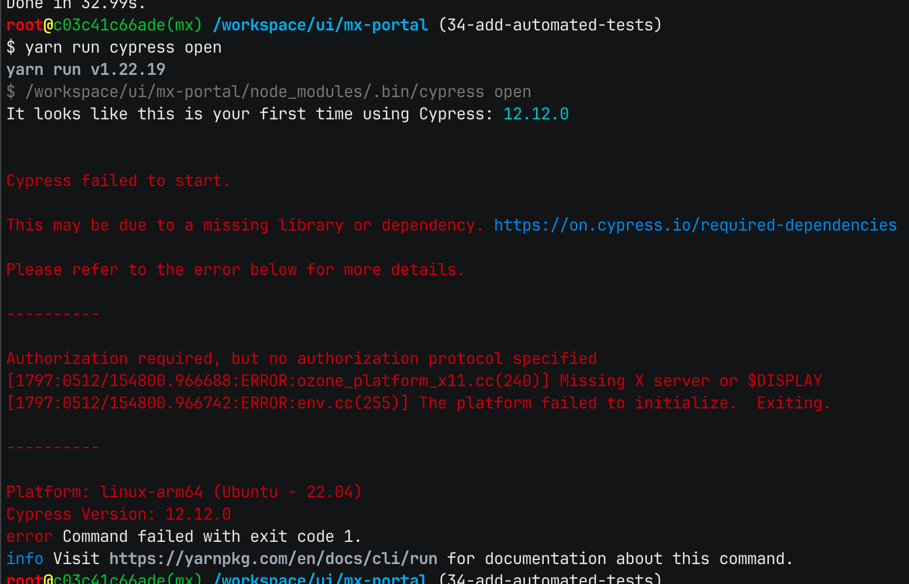

# Cypress End-to-End Testing

## Table of Contents

- [Overview](#overview)
- [Getting Started](#getting_started)
- [Interactive Mode](#interactive_mode)
- [Troubleshooting](#troubleshooting)

## Overview
Cypress End-to-End Testing is a powerful testing framework that allows you to automate and validate the behavior of your web applications. It provides an intuitive and developer-friendly interface for creating tests, making it easier to catch bugs and ensure the quality of your application.

With Cypress, you can simulate real user interactions, such as clicking buttons, filling out forms, and navigating between pages. It runs directly in the browser, allowing you to observe and debug your tests in real-time, which significantly speeds up the development and debugging process.

## Getting Started
To start using Cypress in your project with the GDC, follow the steps below:
1. Create a `.env-gdc` file in the root directory of your project repository and add the following environment variables:
    ```
    export EXTRA_PACKAGES="libgtk2.0-0 libgtk-3-0 libgbm-dev libnotify-dev libgconf-2-4 libnss3 libxss1 libasound2 libxtst6 xauth xvfb"
   
   # only needed for interactive mode
   export GDC_ENV_DISPLAY="host.docker.internal:0"
    ```
   **Note:** The `EXTRA_PACKAGES` environment variable must be set as shown to run headless tests. Additionally, setting the `GDC_ENV_DISPLAY` environment variable configures the GDC for Cypress Interactive Mode.


2. For new projects, the GDC is configured and ready to be used with Cypress. Follow the [Cypress documentation](https://docs.cypress.io/guides/getting-started/installing-cypress) for installing and using Cypress. For existing projects, stop the GDC (if running) and restart it using the command below. Doing so will clear the GDC build cache and allow the Cypress dependencies (`EXTRA_PACKAGES`) to be downloaded and installed during the next build process.
    ```
    CLEAN=yes run-dev-container.sh
    ```
   
## Interactive Mode
With Cypress installed in the GDC, you may use Interactive Mode with the GDC by following the steps below:

### macOS
1. Install XQuartz on your host machine:
    ```
    brew install --cask xquartz
    ```
2. Run XQuartz on your host machine:
    ```
    open -a XQuartz
    ```
3. From your host machine's Apple menu, select **XQuartz > Settings...**


4. Select the `Security` tab and ensure that **Allow connections from network clients** is enabled.
    


5. From within the terminal of your host machine, add the GDC address to X11 server access control list by running the following command:
    ```
    /usr/X11/bin/xhost + host.docker.internal
    ```
6. From the GDC terminal, change into your UI project directory containing the `package.json` file and Cypress installation.


7. Start your development server.


8. Run `npx cypress open`, `yarn run cypress open`, or any command for a custom script listed within your `package.json` file.
### Windows

1. Download and install VcXsrv Windows X Server onto your host machine from [SourceForge.net](https://sourceforge.net/projects/vcxsrv/). 


2. Run VcXsrv Windows X Server on your host machine.


3. Add `host.docker.internal` to the server's access control list.


4. From the GDC terminal, change into your UI project directory containing the `package.json` file and Cypress installation.


5. Start your development server.


6. Run `npx cypress open`, `yarn run cypress open`, or any command for a custom script listed within your `package.json` file.

## Troubleshooting

### Cypress Failed to Start


1. If you encounter a missing library or dependency error like the one depicted above, try running the following command from the terminal on your host machine, followed by re-attempting to run Interactive Mode from within the GDC terminal:
    ```
    xhost + host.docker.internal
    ```
   **Note:** If the xhost command is not found, it may not be listed in your path. Try `/usr/X11/bin/xhost`.
   

2. Ensure that `host.docker.internal` in your hosts file on your local machine is pointing to `127.0.0.1`. For macOS, the hosts file is located at `/etc/hosts`. For Windows, the hosts file is located at `c:\windows\system32\drivers\etc\hosts`.
    
    **NOTE**: Admin permissions are required to edit the hosts file. Use `sudo` for macOS. For Windows, edit the file as an administrator.
