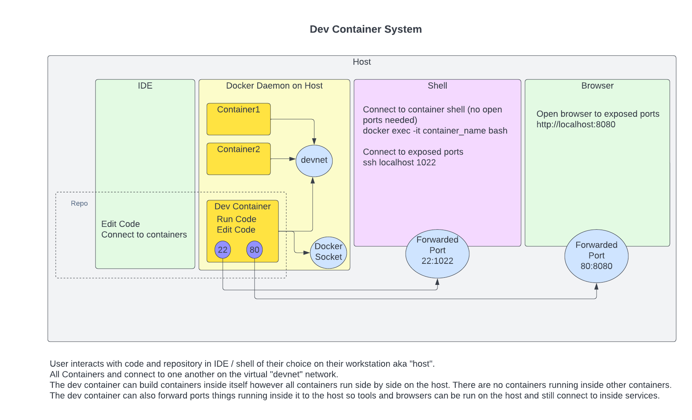
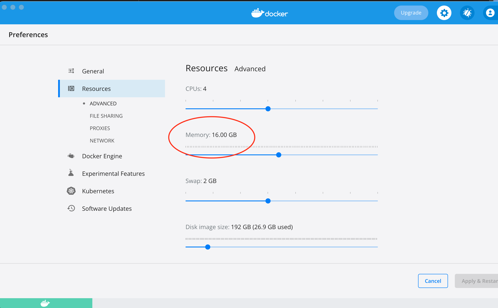
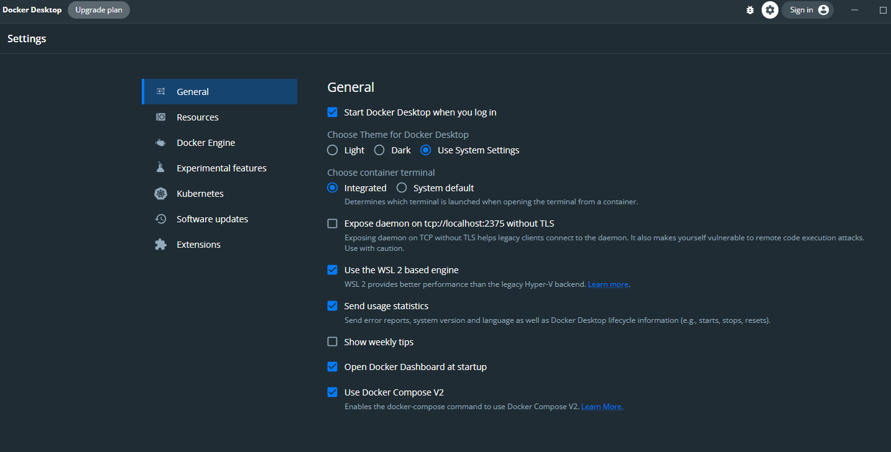

# Containerized development tool
## Developer Platform



# Install required tools

**Docker Desktop** is required. If you don't have installed you can install by going to: https://www.docker.com/products/docker-desktop  
Run the installer and accept all the defaults.

**Start Docker Desktop, give it more memory, and restart it**
The default is 2GB. Increase this to at least 4GB, we recommend half your system's memory up to 16GB.


Ensure that "Use Docker Compose V2" is selected on the General tab. If this is not done your container names will not be correct.  
If your not on windows your screen may look different however there will be a checkbox for Compose V2.


If you're on Windows, and it's integrated with WSL2, your Docker Desktop Settings will look like this.


# Setup

## Git config
Set the following environment variables if you want the container to set up your .gitconfig.  
The system will try to copy .gitconfig from you host home before creating one if USE_HOST_HOME=yes.

```bash
GIT_EMAIL=<your email address>
GIT_NAME=<your name>
```

## Update your hosts file
### Mac
Modify `/etc/hosts` and add the line
```
127.0.0.1	host.docker.internal
```
### Windows
Docker Desktop probably did this for you already.
Checkout your hosts file to make sure. `C:\Windows\System32\drivers\etc\hosts`

Run editor as Admin to edit it if necessary.

## Optional
### Symlink `run-dev-container.sh` in the dev container repo to a bin folder in your path.
This will allow you to more easily launch dev containers.

# Concepts
There is only one docker daemon running on the host. The docker daemon does not get run inside the dev container.  
The dev container communicates with the host docker daemon using the docker socket that is mounted inside the dev container.

When you run a container from inside the dev container it is started on the host and runs alongside the dev container.  
There is no container inside container nesting. All containers are siblings.

Building a container inside the dev container will act as expected in terms of file paths / operations.  
The tricky part has to do with volume mounts. Since the newly built container will run alongside the dev container and not in it,
You must specify mount points as absolute host paths.  
Example to mount something from within the dev container workspace:
```yaml
version: "3.8"

services:
    mycontainer:
        volumes:
          - ${HOST_PROJECT_PATH}/configs/myconfig:/etc/myconfig

```
Ports that are exposed to the host can be accessed inside of containers via host.docker.internal.  
The host record 127.0.0.1 host.docker.internal on the host allows it to use the same name.  
This allows you to use same DNS name both inside and outside of containers.

# Open Directory in Container
Now that you've finished setting up your host.
run the script `run-dev-container.sh` in the root of this repository.

Running with no arguments or `-h` as first arguments will display help.

`run-dev-container.sh STACK_NAME [GDC_RUN_MODE | PORT_FWD | GDC_ENTRYPOINT]`
* your current working directory will be mounted in container on `/workspace`
* STACK_NAME required, is used to name the stack in case you want to run more than one.
* GDC_RUN_MODE optional, valid values are start, stop, daemon, clean. **start** is the default.
* * start will start the GDC environment.
* * daemon will start a GDC environment in the background.
* * stop will shut down a running GDC environment running in foreground or background.
* * clean start GDC environment with CLEAN=yes flag.
* PORT_FWD optional, is in compose port forward format. Example 80:8080 or 4000-4005. You can specify this param more than once.
* GDC_ENTRYPOINT optional, runs a command in the GDC."
* * the docker compose exit code will mirror the return code of the entrypoint command."
* * if the entrypoint command returns a non-zero exit code even if GDC_RUN_MODE=daemon then compose will exit."

# Environment Options
These options control what packages / functionality are built into the container.  
`USE_` vars are **yes / no** values for toggling related options.

* PROJECT_NAME=<set to 1st command line parameter when run-dev-container.sh is invoked> - used to suffix DEVNET_NAME, LOCALSTACK_VOLUME_DIR, DEV_CONTAINER_NAME.
* DEV_CONTAINER_NAME=dev-1 - sets the dev container name and is prepended with PROJECT_NAME.
* COMPOSE_BIN=docker-compose - sets method of execution for compose. Should be set to ether "docker compose" or "docker-compose"
* ROOT_PW=ContainersRule - sets root password in container.
* CHECK_UPDATES=yes - check for GDC updates on each login.
* USE_WORKSPACE=yes - mounts folder from host into /workspace folder in container. Setting this option to "no" is useful if you only want to use tools inside the container and not interact with a project.    
* USE_HOST_HOME=yes - mounts users home directory into container under /root/host-home. Required by some other options.
* USE_HOME_BIN=no - copy bin folder from host home directory if it exists. Enables USE_HOST_HOME.
* PULUMI_VERSION=latest - a version or "latest" must be specified for Pulumi to be installed.
* PHP_VERSION=<not set> - installs any of the following PHP versions 5.6, 7.0, 7.1, 7.2, 7.3, 7.4, 8.0, 8.1
* USE_DOT_NET=no - installs .NET SDK v6.x
* USE_JAVA=no - installs headless openjdk v11.x.
* USE_PRECOMMIT=yes - installs git pre-commit hooks in repo if not already installed. Enables Python if not already enabled.
* PYTHON_VERSION=3.10.5 - installs Python v3.10.5.
* USE_AWS=yes - installs the latest AWS CLI, SSM Plugin and EKS IAM auth helper as well as aws helper scripts and aliases.
* AWS_VERSION=2.9.7 - installs specified AWS cli version.
* USE_AWS_HOME=yes - copies ~/.aws folder from host if exists to container /root/.aws. Enables USE_HOST_HOME.
* USE_BITWARDEN=yes - installs Bitwarden cli and enables NODE_VERSION=18 if NODE_VERSION is not already configured.
* PERSIST_BITWARDEN_SESSION=no - persist bitwarden session to /root/persisted volume and autoload it in subsequent logins. Reduces need to enter master password, but is less secure.
* NODE_VERSION=18 - installs NVM and requested node version.
* USE_LOCALSTACK=yes - enables some localstack helpers.
* USE_LOCALSTACK_PERSISTENCE=yes - toggle persistent storage for LS defaults to persistence enabled.
* LOCALSTACK_VOLUME_DIR=$HOST_PROJECT_PATH/ls_volume.
* LS_MAIN_CONTAINER_NAME=localstack_PROJECT_NAME - used by localstack to name main container. Can also be accessed via this name inside containers.
* LS_IMAGE=localstack/localstack - can override with custom image location. Still uses LS_VERSION to create final image location.
* LS_VERSION=<not set> - starts a localstack container running specified version.
* USE_LOCALSTACK_HOST=yes - forwards localstack ports to host if LS_VERSION is set.
* LOCALSTACK_HOST_DNS_PORT=53 - when LocalStack is running in host mode forward this port from host to localstack. Set to blank string to disable localstack DNS forward.
* LOCALSTACK_API_KEY=<not set> # only needed for local stack pro.
* USE_AUTH0=no - starts an auth0 mock authentication server. Can be accessed via name auth0_mock inside containers. [Auth0 Mock docs](./docs/auth0/readme.md).
* USE_AUTH0_HOST=yes - starts an auth0 mock authentication server with host port forward.
* AUTH0_HOST_PORT=3001 - sets host port for auth0 mock server to listen on if USE_AUTH0_HOST=yes.
* AUTH0_CONTAINER_NAME=auth0_mock_PROJECT_NAME - set name of auth0 container so more than one can be used in parallel.
* AUTH0_LOCAL_USERS_FILE=<not set> - used to specify location in container relative to /workspace for auth0 to mount users-local.json override file.
* AUTH0_AUDIENCE=portal - used to override auth0 audience default of app.
* AUTH0_DEFAULT_USER=user1 - used to auto-populate login form.
* AUTH0_DEFAULT_PASSWORD=user1 - used to auto-populate login form.
* USE_COLOR_PROMPT=yes - enables colorized bash prompt in container.
* SSH_KEYSCAN_HOSTS=gitlab.com github.com bitbucket.org - copies SSH keys from list of hosts to known-hosts file.
* SSH_SERVER_PORT=<not set> - if set will start sshd and forward this port from host to sshd in container.
* PORT_FWD0 through PORT_FWD9=<not set> - allows up to 10 custom ports to forwards to specified in docker compose format.
* EXTRA_PACKAGES=<not set> - if set should be a quoted space separated list of ubuntu:latest packages names you want installed.
* NO_SSH_AGENT=<any value> - set this to any value to disable any attempt to mount SSH agent socket inside dev container.
* DOCKER_VERSION=20.10.9 - install docker version inside container.
* DOCKER_COMPOSE_VERSION=2.10.2 - install docker-compose version inside container.
* DEVNET_NAME=<auto set to devnet_PROJECT_NAME> - name of gdc dev network that all containers will be attached to.
* DEVNET_SUBNET=<not set> - cidr notation subnet.
* DEVNET_GATEWAY=<not set> - gateway ip inside DEVNET_SUBNET.
* CLEAN=<not set> - stops and removes existing stack and devnet, then does docker system prune before starting new dev container.
* CLEAN_ONLY=<not set> - stops and removes existing stack and devnet, then does docker system prune and exits.
* VISUAL=vi - editor for visual editing. Usual set to same as EDITOR var.
* EDITOR=vi - editor for less advanced terminal editing. Usually set to same as VISUAL var.
* DOCKER_OS_PLATFORM=<not set> can be used by docker commands to build containers for other arch's.
* GDC_ENTRYPOINT=<not set> - runs the command in the GDC then exits if GDC_RUN_MODE!=daemon.
* SHARED_VOLUMES_EXTRA=<not set> - list separated by space of custom volumes you want shared between all GDC's.
* GDC_RUN_MODE=start - valid options are start, stop, and daemon.
* FORCE_PROJECT_PATH=<not set> - if this is specified then WORKSPACE will be mounted from this path instead of current working directory.
* HOST_CUSTOM_MOUNT=<not set> - used to mount custom dir on host to /host_custom_mount in container.
* NO_DEVNET_RM=<not set> # if set to yes, GDC will not remove the DEVNET.
* COMPOSE_EX=<not set> - add specified compose yaml file to list of compose files that get loaded for solution. Note paths in specified compose.yaml are relative to generic-dev-container repo folder.
* STARTUP_MSG=<not set> - dispays this message after container has started and init script is complete.

# Extra environment vars available in dev container
* HOST_PROJECT_PATH - Absolute path to mounted workspace on host. Can be used to map /workspace paths to host paths.
* HOST_PROJECT_FOLDER_NAME - dirname $HOST_PROJECT_PATH
* GDC_PARENT - if GDC is launched from inside another GDC this will be set to name of parent.
* HOST_HOME - set to user's home directory on host machine.
* GDC_CONTAINER_NAME - name of GDC container running in docker.
* GDC_COMPOSE_FILES - contains list of all compose files in use to run GDC.
* AUTH0_DOMAIN - generated using a combination of USE_AUTH0,USE_AUTH0_HOST,AUTH0_HOST_PORT,AUTH0_CONTAINER_NAME. 
* SHARED_VOLUMES - list of volumes shared between all GDC's.
* CUSTOM_PORTS - list of custom ports forwards from host to container.
* GDC_DIR - contains host location of GDC folder. 
* DEV_CONTAINER - set to current dev container version. You can also use this to detect if you are running in a dev container.

# To pass custom environment variables to the dev container prefix variable name with GDC_ENV_
For example, to set a custom environment variable inside the dev container like MY_VAR="MY VALUE". Execute something like the following  
```bash
GDC_ENV_MY_VAR="MY VALUE" run-dev-container.sh proj
```
After shelling into the dev container you can do:
```bash 
echo $MY_VAR
```
You should see "MY VALUE" 

# Environment files
The above environment variable values are the default unless overridden by environment variables setup in your environment or on the command line.   
Specific gdc related env files `GDC_PROJECT_PATH/.env-gdc`, `GDC_PROJECT_PATH/.env-gdc-local`, `$HOST_PROJECT_PATH/.env-gdc` and `$HOST_PROJECT_PATH/.env-gdc-local` will be sourced if they exist in the order listed before building and launching the container.  
`.env-gdc` should be checked in with project and `.env-gdc-local` should be ignored by `.gitignore`.  
## Variables set in the the environment files must be exported! 

Format of the files should be as follows:
```bash
export ENV_VAR_NAME=ENV_VAR_VALUE
```

Example:
```bash
export ROOT_PW=iAmGroot
```

# Special folders
* **/var/run/docker.sock** - mounted from host to allow docker to be used and controlled from within container.
* **/workspace** - folder is the project folder mounted from the host.
* **/root/persisted** - is a persisted volume between containers of same stack.
* **/root/bash_history** - is a persisted volume for bash history between containers of same stack.
* **/root/shared** - is a persisted volume that is shared between all dev containers regardless of stack.
* **/root/home-host** - when USE_HOST_HOME=yes folder is mounted from users home directory on host.
* **/root/gdc-host** - GDC root folder is mounted from host. 
* **/root/.pulumi** - folder is a persisted volume shared between all dev containers.
* **/root/.cache** - folder is a persisted volume shared between all dev containers.
* **/root/.config** - folder is a persisted volume shared between all dev containers.
* **/root/bin-extra** -- folder contains helper scripts for GDC.
* **/root/bin-extra/aws** - folder contains aws related helper scripts. Only added to path if USE_AWS=yes is set.
* **/root/bin-extra/docker** - folder contains docker related helper files and is added to path.
* **/root/bin-extra/ls** - folder for localstack helper files and is added to path.
* **/root/bin-extra/auth0** - folder for auth0 helper files and is added to path. 
* **/root/bin** - when USE_HOST_HOME=yes and USE_HOME_BIN=yes folder is copied from /root/home-host/bin if it exists.
* **/root/.aws** - when USE_AWS_HOME=yes folder is copied from /root/home-host/.aws if it exists, otherwise it will be symlinked to /root/shared/.aws volume if it exists.
* **/usr/local/share/.cache** - used to persist cache for npm, yarn, and pip


## .bashrc hook
When **.bashrc** is loaded if the following file is present it will be sourced `/root/persisted/bash_rc_ext.sh`.
This allows persisted customization to login shell.

# GIT pre-commit hooks
When the environment var **USE_PRECOMMIT=yes** the container on startup will check if pre-commit has already been set up on project.  
If it has not it will do a `pre-commit install` in the /workspace folder which should map to the repository root.  
The repository should have commit rules setup to run formatting and linting before the commit.  
Python files will be formatted using black and flake8 standards, so you should ensure your IDE of choice is set the same.  
On your first commit the pre-commit plugin will need to download and install some additional plugins, so you may experience a delay on 1st commit.  
If any files fail to format or pass lint after being formatted the commit will be rejected until the issues displayed are corrected.


# Examples
### Create a dev container for a project finance-portal stored in /repos folder.
* Disables color prompt in shell
* Mounts /repos/finance-portal to /workspace inside of container.
* names the dev stack "fp"
* Forwards port 3030 inside container to host port 3030.
```bash
USE_COLOR_PROMPT=no /repos/generic-dev-container/run-dev-container.sh /repos/finance-portal fp 3030:3030
```

### Create a dev container in current folder and start SSH server in container
* Launch dev container in current folder
* Names the stack "dev"
* Enables SSH server and forwards port 1022 on host to sshd in container
* sets root password to IamGroot
```bash
SSH_SERVER_PORT=1022 ROOT_PW=IamGroot `pwd` dev
```

### Open shell inside of container with stack named "fp"
```bash
docker exec -it fp-dev-1 bash -l
```
You want to specify the "-l" parameter to bash to ensure it behaves as a login shell.  
**Failure to do so may cause some environment variables to unset or incorrect.**  
Also note that using the shell button in the docker services tab of your does not execute the shell as a login shell.  
Instead you should find the dev container in the container list right click it and select "Exec"  
Then select the "Create and run" option and type "bash -l"  
After doing this once you only have to right-click on container select "Exec" and click the already available option of "bash -l"


### Open `/repos/finance-portal` in your favorite IDE and edit as you like.

### Assume an AWS role in the dev container
AWS_USERNAME is usually first_name.last_name but that is not a strict requirement and depends on your setup.  
AWS_PROFILE_NAME is how you named your aws profile in your aws config file.
```bash
source assume-role.sh AWS_USERNAME AWS_PROFILE_NAME arn:aws:iam::AWS_ACCOUNT_NUM:role/ROLE_NAME MFA_TOKEN
```

### Sample using real values
```bash
source assume-role.sh paul.robello paul-identity arn:aws:iam::441193001985:role/sandboxAdmin MFA_TOKEN
```

### Connect to AWS jumphost after assuming role
JUMP_HOST_REGION is the aws region where the jumphost is deployed examples us-west-2, us-east-1, etc...
```bash
export AWS_REGION=JUMP_HOST_REGION;export AWS_PROFILE=AWS_PROFILE_NAME;ssm-ssh.sh JUMP_HOST_INSTANCE_ID
```
### Sample using real values
```bash
export AWS_REGION=us-west-2;export AWS_PROFILE=paul-identity;ssm-ssh.sh i-04b4c8a1ddc845fb8
```

### Forward port from dev container to AWS service after assuming role
JUMP_HOST_REGION_WITH_AZ means you must append the correct availability zone where the jumphost is deployed a,b,c,d to the region. Example us-west2a
```bash
export AWS_REGION=JUMP_HOST_REGION;ssm-jump-tunnel.sh JUMP_HOST_INSTANCE_ID JUMP_HOST_REGION_WITH_AZ LOCAL_PORT REMOTE_HOST REMOTE_PORT
```

### Sample using real values
```bash
export AWS_REGION=us-west-2;ssm-jump-tunnel.sh i-04b4c8a1ddc845fb8 us-west-2a 6432 rds-cluster-dev.cluster-ao65ukd5fsic.us-west-2.rds.amazonaws.com 5432
```
If you want to use a tool on your host to connect to the tunnel opened in your dev container then you must forward the port to the host when creating the dev container.  
Example if you want to use pg_admin on your host to connect to an RDS in AWS, you would create the container with something like
```bash
run-dev-container.sh fp 6432:6432
```
Then assume your role and forward your port like the examples above.  
Then you can open pg_admin on your host and connect to 127.0.0.1:6432.  
This will pass the connection from the host port 6431 to the container port 6432 which will then be forwarded through the jump tunnel to the rds on port 5432.


# Networking
### devnet
A special virtual network named "**devnet**" is created and all dev containers are attached to it.
This allows them all to communicate with one another as well as any other containers attached to it.  
Its recommended that if you create additional containers that you attach them to the same network to allow for easier debug and connections.
```yaml
version: "3.8"

services:
  mycontainer:
    networks:
      devnet:

networks:
  devnet:
    external: true
```
The network name for devnet can be overridden with environment variable DEVNET_NAME

### /var/run/docker.sock
The docker socket is mounted inside the dev container giving it full access to the docker daemon.

### PORT_FWD1 environment variable
This enables a single port or port rage to be forwarded from the host to the container.  
Example:  PORT_FWD1="8080:80" would forward port 8080 from host to port 80 inside the dev container.

### PORT_FWD2 environment variable
This enables a single port or port rage to be forwarded from the host to the container.  
Example:  PORT_FWD2="2000-2020" would forward port range 2000-2020 from host to corresponding ports inside the dev container.

### SSH_SERVER_PORT
This enables the sshd server in the container and starts it inside the container on port 22,
then forwards the specified port on the host to port 22 inside the container.
Example:  SSH_SERVER_PORT=1022  would forward port 1022 on the host to port 22 inside the dev container.


# Helper scripts and aliases
## GDC
* check-gdc-update.sh - checks GDC repo for updated version
* gdcex.sh - executes a command in another GDC related container. Supports tab completion for available container names.
* run-gdc.sh - executes another GDC while inside a GDC. Note you should only launch a GDC from a folder under /workspace.
* gdc-pipeline-exec.sh - allows for running commands from pipeline.

### Aliases
* ls_gdc_network - list all containers running on current GDC network.

## Docker
* docker-logs.sh NAME - NAME can be a full or partial container name to tail the logs of
* docker-shell.sh NAME SHELL - NAME can be a full or partial container name to execute SHELL inside. If SHELL is not specified then bash will be assumed.
* docker-stop.sh NAME - NAME can be a full or partial container name to stop
* docker-stats.sh - shows an auto refreshing list of container stats.


## AWS

### Setting up your AWS account
[AWS SSO Setup](./docs/aws_sso/readme.md) - Allows you to use AWS web console to easily access all accounts you have access to.

[AWS Identity Setup](./docs/aws_ident/readme.md) - Required if your AWS organization uses an identity account

### Shell scripts. Running without parameters will show help.
* setup-aws.sh - Sets up your local .aws folder with config and credentials files.
* assume-role.sh - Uses SSM to assume role in target account.
* ssm-jump-tunnel.sh - Creates SSM SSH port forward tunnel from host to EC2 container.
* ssm-scp.sh - Copy files to or from EC2 host using SSM SSH.
* ssm-ssh.sh - SSM SSH to EC2 host.
* ssm-send-command.sh - Executes command on EC2 host using SSM.
* export-aws-session.sh - Exports AWS_* and PULUMI_* from environment to a file named aws_session in current folder.
* check-ecs-exec.sh - Checks for needed configs required to shell into ecs containers
* awslocal - requires python be enabled

### Aliases
* unset-aws - Unsets AWS_* and PULUMI_* from environment.
* aws-otp - if aws and bitwarden are enabled this will get and display your aws MFA token.

## Local stack
### Aliases
* awsl - invokes aws cli with endpoint set to localstack
### Commands
* start-ls.sh [-h|host|internal] - starts localstack container in specified mode. If not specified will attempt to autodetect.
* stop-ls.sh [-h|host|internal] - starts localstack container in specified mode. If not specified will attempt to autodetect.

## Auth0
### Commands
* start-auth0.sh [-h|host|internal] - starts auth0 mock container in specified mode. If not specified will attempt to autodetect.
* stop-auth0.sh [-h|host|internal] - stops auth0 mock container. If not specified will attempt to autodetect.
* get-auth-token.sh [username] - logs into auth0 mock and returns auth token. Builds URL with $AUTH0_CONTAINER_NAME and defaults to login of $AUTH0_DEFAULT_USER with pw of $PASSWORD unless username param is specified then that name will look up password in users-local.json or users.json file being used by Auth0 mock.


## Bitwarden
[Bitwarden Setup](./docs/bitwarden/readme.md) - **Optional** paid high efficiency workflow. 

### Aliases
* unlock - unlocks your vault writing session key to /root/.bw_session, syncs it with cloud, and calls load_aliases. /root/.bw_session will be sourced by any other shells you open to reduce need to unlock vault.
* load_aliases - loads the secure note with name aws-ident into your environment.
* bw_reload - syncs vault with cloud and calls load_aliases.
* aws-otp - if aws and bitwarden are enabled this will get and display your aws MFA token.


## Debugging
[Debugging](./docs/debugging/readme.md) - Info on ways to debug scripts in inside the container from IDE running on host. 


## Troubleshooting

### GDC Startup
If your GDC fails to start with an error similar to "failed to solve: executor failed running ..."

This happens when cached layers don't match what the Docker file thinks is already in place.

You can try one of the following environment variables to resolve the error.  
Many times only CLEAN=yes is needed, however if the problem persist you can use CLEAN_ONLY=yes then start the GDC as you normally would.

* CLEAN=yes - stops and removes existing stack and devnet, then does docker system prune before starting new dev container.
* CLEAN_ONLY=yes - stops and removes existing stack and devnet, then does docker system prune and exits.

### Localstack won't let go of old state
* All OS stop all GDC's and localstack containers and remove the following folders if they exist.
* $HOST_PROJECT_PATH/ls_volume folder
* /tmp/ls_volume*
* /c/tmp/ls_volume*

* start GDC and run  *make reset*
